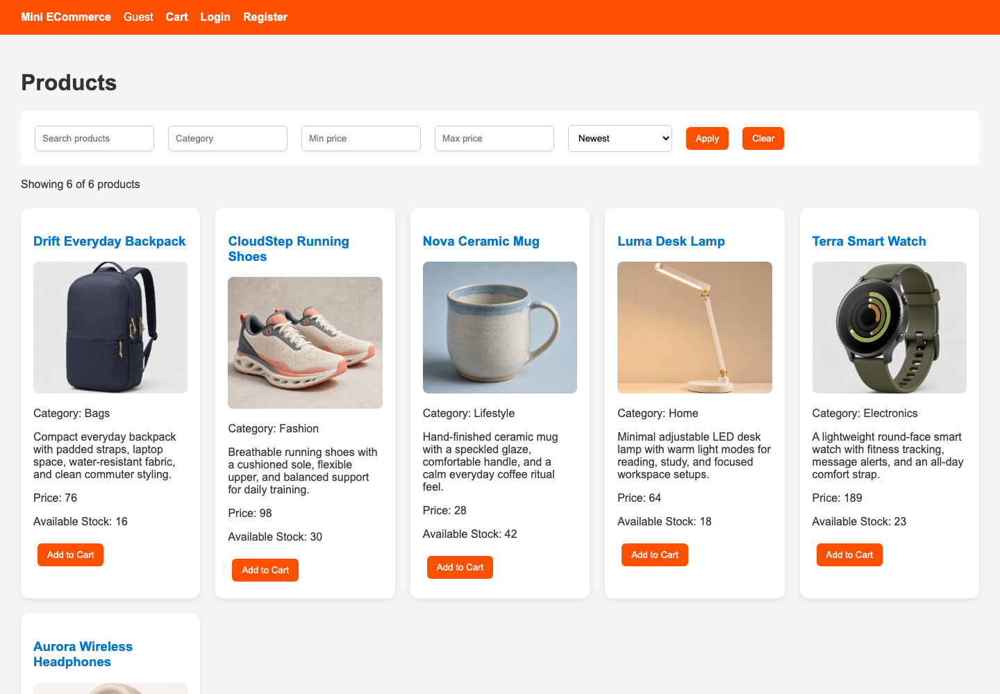
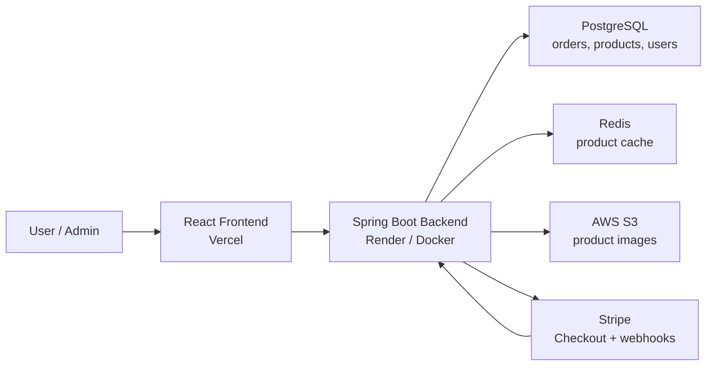
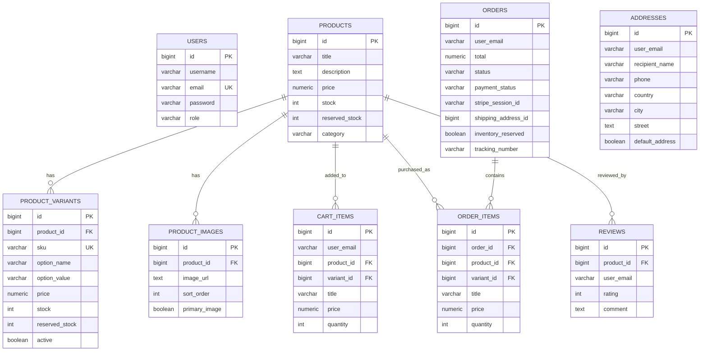

# Full-Stack E-Commerce Platform

[](https://github.com/Ceciliaaabbc/ECommerce_Project/actions/workflows/backend-tests.yml)

A full-stack e-commerce application with a React storefront, Spring Boot REST API, PostgreSQL persistence, Redis-backed product caching, AWS S3 product image upload support, and Stripe Checkout payment integration.

- Frontend repo: [Ceciliaaabbc/ecommerce-frontend](https://github.com/Ceciliaaabbc/ecommerce-frontend)
- Backend repo: [Ceciliaaabbc/ECommerce_Project](https://github.com/Ceciliaaabbc/ECommerce_Project)
- Live demo: [https://ecommerce-frontend-one-theta.vercel.app](https://ecommerce-frontend-one-theta.vercel.app)



## Tech Stack

| Layer | Technologies |
| --- | --- |
| Frontend | React, Vite, React Router, TanStack Query, Playwright |
| Backend | Java 17, Spring Boot 3, Spring Web, Spring Security, Spring Data JPA |
| Database | PostgreSQL, Flyway migrations |
| Cache | Redis |
| Auth | JWT, role-based authorization |
| Payments | Stripe Checkout, Stripe webhook handling |
| Storage | AWS S3-compatible product image upload configuration |
| DevOps | Docker, Docker Compose, Maven, GitHub Actions, Vercel, Render |
| Testing | JUnit 5, Mockito, Spring Boot Test, Testcontainers, MockMvc, Playwright |

## Architecture



## Core Features

- User registration and login with JWT authentication.
- Product browsing with keyword, category, price range, sorting, pagination, variants, and image support.
- Shopping cart with quantity updates, variant selection, stock validation, and item removal.
- Checkout flow that creates a pending order, reserves inventory, and starts a Stripe Checkout session.
- Stripe webhook handling that marks orders as paid, deducts inventory, and clears the cart.
- Order history, order detail pages, payment retry, and unpaid order cancellation.
- Admin dashboard for sales summary, paid/unpaid order counts, user counts, product counts, and low-stock alerts.
- Admin product management with create, edit, delete, search, pagination, low-stock filtering, and image upload.
- Admin order management with filtering, status updates, shipping tracking, and refunds.
- Admin user management with role updates and user deletion.
- Inventory reservation logic for checkout, cancellation, expiration, and payment completion.

## API Examples

Register a user:

```bash
curl -X POST http://localhost:8080/api/users/register \
  -H "Content-Type: application/json" \
  -d '{
    "username": "Test User",
    "email": "test@example.com",
    "password": "123456"
  }'
```

Log in and receive a JWT:

```bash
curl -X POST http://localhost:8080/api/users/login \
  -H "Content-Type: application/json" \
  -d '{
    "email": "test@example.com",
    "password": "123456"
  }'
```

Browse products:

```bash
curl "http://localhost:8080/api/products/browse?keyword=lamp&page=0&size=12&sort=priceAsc"
```

Add an item to cart:

```bash
curl -X POST http://localhost:8080/api/cart \
  -H "Authorization: Bearer <JWT_TOKEN>" \
  -H "Content-Type: application/json" \
  -d '{
    "productId": 1,
    "variantId": 1,
    "quantity": 2
  }'
```

Create a checkout session:

```bash
curl -X POST "http://localhost:8080/api/orders/checkout?shippingAddressId=1" \
  -H "Authorization: Bearer <JWT_TOKEN>"
```

Admin search orders:

```bash
curl "http://localhost:8080/api/orders/admin/search?status=PROCESSING&page=0&size=10" \
  -H "Authorization: Bearer <ADMIN_JWT_TOKEN>"
```

Stripe webhook endpoint:

```bash
POST /api/payments/webhook
```

## Database Schema



## Running Locally

Clone both repositories as sibling directories:

```bash
git clone git@github.com:Ceciliaaabbc/ECommerce_Project.git
git clone git@github.com:Ceciliaaabbc/ecommerce-frontend.git
```

Start the full stack from the backend repository:

```bash
cd ECommerce_Project
docker compose up --build
```

Local URLs:

- Frontend: [http://localhost:5173](http://localhost:5173)
- Backend API: [http://localhost:8080](http://localhost:8080)
- Health check: [http://localhost:8080/actuator/health](http://localhost:8080/actuator/health)
- Swagger UI: [http://localhost:8080/swagger-ui.html](http://localhost:8080/swagger-ui.html)

`docker-compose.yml` starts PostgreSQL, Redis, the Spring Boot backend, and the React frontend. For real Stripe/S3 usage, replace the local placeholder environment variables with valid credentials.

## Testing

Backend tests:

```bash
mvn test
```

Frontend tests:

```bash
cd ../ecommerce-frontend
npm test
npx playwright test
```

The backend test suite covers:

- Unit tests for service-layer business logic, including `InventoryService`, `OrderService`, `OrderStateMachine`, `OrderAddressSnapshotService`, and `JwtUtil`.
- Controller tests for user, product, cart, and order endpoints.
- Spring Boot integration tests with PostgreSQL/Testcontainers and Flyway migrations.
- API flow tests with MockMvc for registration, login, add-to-cart, checkout, payment webhook status updates, and admin refund.
- Negative cases for insufficient stock, missing-token access, non-admin access to admin APIs, duplicate payment, and order cancellation releasing reserved inventory.

Stripe calls are mocked at the boundary in tests, so the backend suite validates application behavior without contacting external payment services.

GitHub Actions runs backend tests on pushes and pull requests to `main`.

